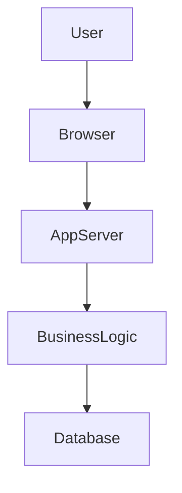
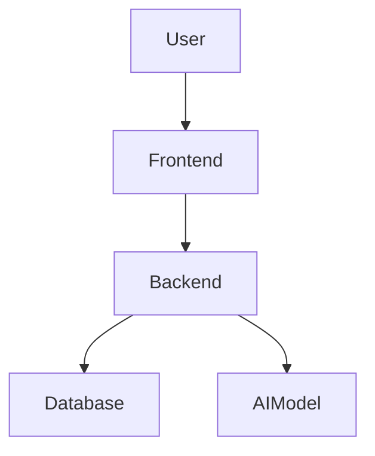
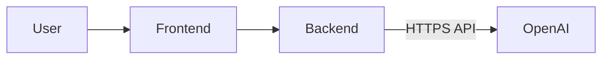
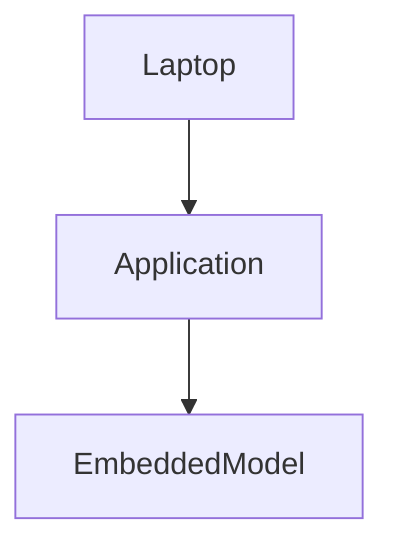
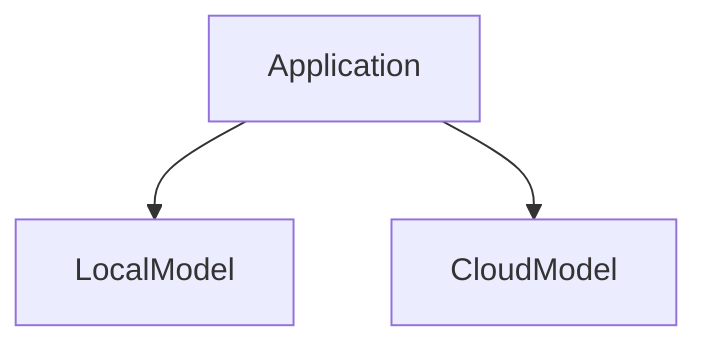
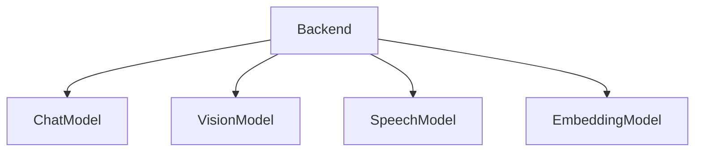
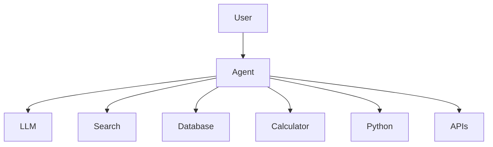

# AI Application Deployment Models
## From Traditional Software Deployment to AI-Powered Applications

**Author:** Dr. Siva Jasthi  
**Last Updated:** July 2026

---

# Table of Contents

1. Introduction
2. Traditional Application Deployment
3. Why AI Changes Deployment
4. AI Deployment Models
   - Hosted AI APIs
   - Self-Hosted Models
   - Embedded AI
   - Hybrid AI
   - Private Enterprise AI
   - Multi-Model Architecture
   - Agent-Based Deployment
   - Serverless AI
5. Comparison Matrix
6. Choosing the Right Deployment Model
7. Summary

---

# 1. Introduction

For decades, deploying software applications was relatively straightforward:

- Build the application
- Package it
- Deploy it to a server
- Users interact with the application

Artificial Intelligence changes this model.

Modern AI applications are composed of multiple independent services. The application itself may not contain the intelligence—it may communicate with one or more AI models running somewhere else.

Instead of deploying **one application**, we are often deploying an **ecosystem of services.**

---

# 2. Traditional Application Deployment

A traditional application contains:

- User Interface
- Business Logic
- Database

Everything is owned by the development team.

## Components

### User Interface
- React
- Angular
- ASP.NET
- Java Swing
- Mobile App

### Application Server
Contains all business rules.

Examples

- Java Spring Boot
- ASP.NET Core
- Node.js
- Flask
- FastAPI

### Database

Stores

- Users
- Orders
- Products
- Transactions

Examples

- SQL Server
- PostgreSQL
- Oracle
- MySQL

---

## Traditional Deployment

Everything is deployed together.

---

## Advantages

- Simple architecture
- Easy debugging
- Low latency
- Full control

---

## Limitations

Adding AI capabilities requires

- Large GPU hardware
- Machine learning infrastructure
- Model management

---

# 3. Why AI Changes Deployment

An AI application rarely contains the model itself.

Instead, it communicates with specialized AI services.

The AI model may live

- OpenAI
- Azure
- AWS
- Google Cloud
- Your own GPU cluster

The application becomes an orchestrator rather than doing all processing itself.

---

# AI Deployment Models

---

# 4. Deployment Model 1
# Hosted AI APIs

## Purpose

The application sends prompts to an AI provider over HTTPS.

The provider hosts and maintains the model.

Examples

- OpenAI
- Azure OpenAI
- Anthropic
- Google Gemini
- Mistral API

---

---

## Advantages

- Fastest deployment
- No GPU hardware
- Automatic scaling
- Latest models
- Minimal DevOps

---

## Disadvantages

- Ongoing API cost
- Internet dependency
- Vendor lock-in
- Data leaves your environment

---

## Best For

- Startups
- Chatbots
- Internal tools
- Rapid prototyping

---

# 5. Deployment Model 2
# Self-Hosted AI

## Purpose

You host the model yourself.

Possible inference servers

- vLLM
- Ollama
- HuggingFace TGI
- NVIDIA NIM

Models

- Llama
- Qwen
- DeepSeek
- Mistral

---

## Advantages

- Full control
- Better privacy
- No per-token pricing
- Custom fine tuning

---

## Disadvantages

- Expensive GPUs
- Infrastructure complexity
- Monitoring required
- Upgrades are your responsibility

---

## Best For

- Healthcare
- Banking
- Defense
- Large enterprises

---

# 6. Deployment Model 3
# Embedded AI

## Purpose

The AI model runs directly on the user's device.

Examples

- Phi-3 Mini
- Gemma
- ONNX Runtime

---

## Advantages

- Offline operation
- Very low latency
- Excellent privacy
- No API cost

---

## Disadvantages

- Smaller models only
- Limited memory
- Limited reasoning capability

---

## Best For

- Mobile apps
- Desktop software
- Edge computing

---

# 7. Deployment Model 4
# Hybrid AI

## Purpose

Use local AI for simple tasks and cloud AI for complex reasoning.

Decision examples

Simple questions

↓

Local model

Complex reasoning

↓

GPT-5

---

## Advantages

- Lower costs
- Better privacy
- Faster responses
- Improved reliability

---

## Disadvantages

- More complex architecture
- Routing logic required

---

## Best For

Enterprise copilots

---

# 8. Deployment Model 5
# Private Enterprise AI

Everything stays inside the company network.

---

## Advantages

- Maximum security
- Compliance
- Data sovereignty

---

## Disadvantages

- Highest infrastructure cost
- Requires AI operations team

---

## Best For

Government

Banks

Healthcare

Defense

---

# 9. Deployment Model 6
# Multi-Model Deployment

Different AI models perform different tasks.

Example

GPT

↓

Reasoning

Whisper

↓

Speech

Qwen-VL

↓

Vision

Embedding Model

↓

Vector Search

---

## Advantages

- Best model for each task
- Better accuracy
- Flexibility

---

## Disadvantages

- More integration work
- More monitoring
- Higher operational complexity

---

## Best For

Production AI systems

---

# 10. Deployment Model 7
# Agent-Based Deployment

Instead of calling a single model, an intelligent agent decides what tools to use.

Frameworks

- LangGraph
- Semantic Kernel
- OpenAI Agents SDK
- CrewAI

---

## Advantages

- Supports complex workflows
- Multi-step reasoning
- Tool usage
- Automation

---

## Disadvantages

- Harder debugging
- Higher latency
- More expensive

---

## Best For

AI assistants

Research agents

Automation

---

# 11. Deployment Model 8
# Serverless AI

Each request invokes a cloud function.

Platforms

- AWS Lambda
- Azure Functions
- Google Cloud Functions

---

## Advantages

- Pay only when used
- Automatic scaling
- Simple deployment

---

## Disadvantages

- Cold starts
- Function execution limits

---

## Best For

Low-volume applications

Event-driven systems

---

# 12. Comparison Matrix

| Deployment Model | Cost | Privacy | Complexity | Performance | Typical Users |
|-----------------|------|----------|------------|------------|---------------|
| Hosted API | Medium | Low | Very Low | High | Startups |
| Self Hosted | High | Excellent | High | High | Enterprises |
| Embedded AI | Low | Excellent | Medium | Very High | Desktop/Mobile |
| Hybrid | Medium | High | High | Very High | Enterprises |
| Private Enterprise | Very High | Excellent | Very High | High | Regulated Industries |
| Multi-Model | Medium-High | Depends | High | Excellent | Advanced AI Apps |
| Agent-Based | High | Depends | Very High | Medium | AI Assistants |
| Serverless | Low | Depends | Low | Medium | Event Driven Apps |

---

# 13. Choosing the Right Deployment Model

| Situation | Recommended Model |
|------------|------------------|
| College Project | Hosted API |
| Startup MVP | Hosted API |
| Internal Corporate Tool | Hosted API or Hybrid |
| Banking | Private Enterprise |
| Healthcare | Self Hosted |
| Military | Private Enterprise |
| Offline Desktop Application | Embedded AI |
| AI Coding Assistant | Hybrid |
| Enterprise Knowledge Assistant | Multi-Model + Agent |
| Event Driven Automation | Serverless |

---

# 14. Traditional vs AI Deployment

| Traditional Application | AI Application |
|--------------------------|----------------|
| Deploy one application | Deploy multiple services |
| CPU only | CPU + GPU |
| Business logic in code | Reasoning in LLM |
| Database stores data | Vector DB stores embeddings |
| REST APIs | REST APIs + AI APIs |
| Fixed workflows | Dynamic agent workflows |
| Easy monitoring | AI observability required |
| Software versioning | Software + Model + Prompt versioning |

---

# 15. The Evolution of Software Deployment

---

# Key Takeaways

- Traditional applications are deployed as a single software system.
- AI applications are distributed systems composed of many services.
- AI models can be hosted in the cloud, self-hosted, embedded in devices, or deployed using hybrid architectures.
- There is no universally "best" deployment model; the right choice depends on cost, privacy, performance, compliance, and operational complexity.
- Modern enterprise AI applications often combine multiple deployment models, using cloud APIs for advanced reasoning, local models for low-latency tasks, and agents to orchestrate workflows across several specialized AI services.

---

# Discussion Questions

1. Why might a startup choose a hosted AI API instead of self-hosting a model?
2. When would a company prefer a hybrid deployment over a fully cloud-based solution?
3. Why are vector databases commonly used in AI applications but not in traditional web applications?
4. What challenges arise when deploying multiple AI models in a single application?
5. How do AI agents differ from simply calling an LLM API?
6. Which deployment model would you recommend for:
   - A medical diagnosis assistant?
   - A mobile language-learning app?
   - A customer support chatbot?
   - An autonomous software engineering assistant?
