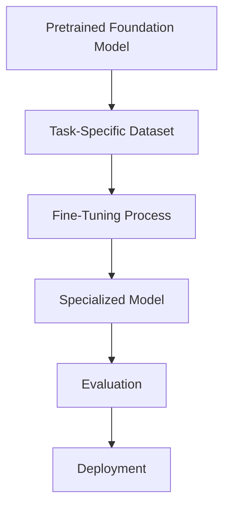
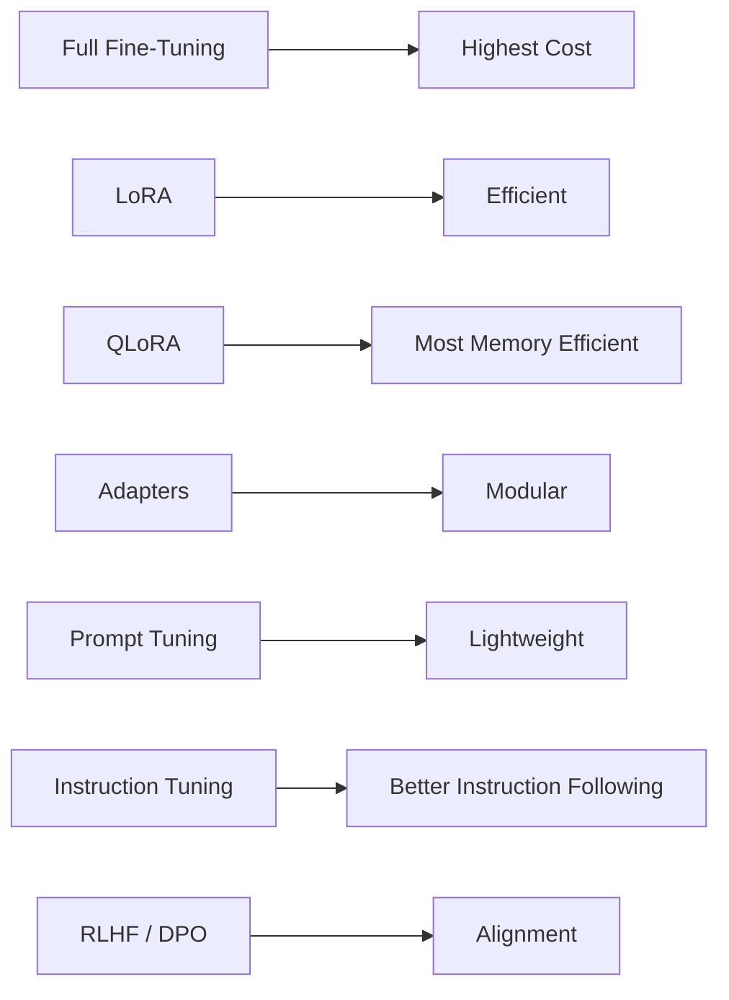
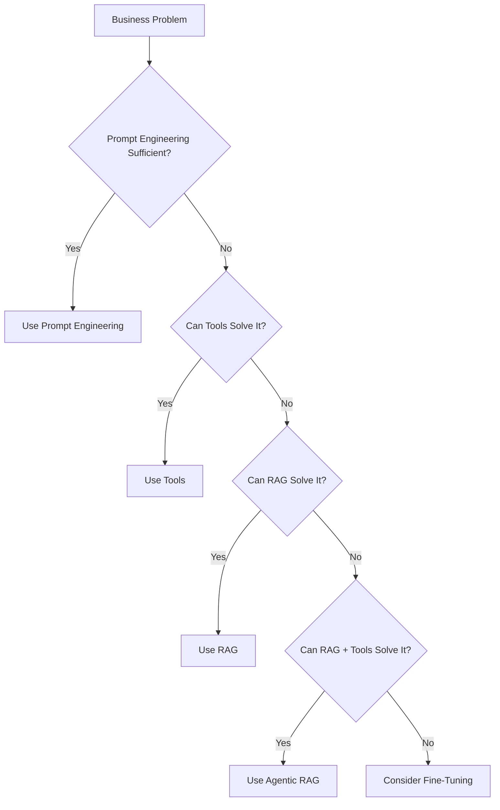

# fine_tuning_llms.md

# Fine-Tuning Large Language Models (LLMs)

## 1. Introduction

Large Language Models (LLMs) are typically trained in two major phases:

1. **Pretraining** – Learning general language, reasoning, and world knowledge from massive datasets.
2. **Fine-Tuning** – Adapting the pretrained model to a specific task, domain, behavior, or style.

Fine-tuning allows organizations to customize a foundation model for their own needs without training an entirely new model from scratch.

---

# 2. What is Fine-Tuning?

Fine-tuning is the process of continuing the training of a pretrained model using a smaller, task-specific dataset.

The model already understands language and reasoning. Fine-tuning adjusts the model's weights so it becomes better at:

* Domain-specific tasks
* Specialized terminology
* Structured outputs
* Organization-specific workflows
* Custom writing styles
* Tool-calling behaviors

---

# 3. Why Fine-Tune a Model?

Fine-tuning can improve:

## Domain Expertise

Examples:

* Healthcare
* Finance
* Legal
* Manufacturing
* Education

The model learns specialized vocabulary and concepts.

---

## Output Consistency

Fine-tuning can teach the model to consistently generate:

* Reports
* Summaries
* Compliance documents
* Customer support responses
* Technical documentation

---

## Organizational Style

Organizations often require:

* Specific tone
* Formatting standards
* Terminology
* Writing guidelines

Fine-tuning helps enforce these patterns.

---

## Task-Specific Behavior

Examples:

* Classification
* Sentiment analysis
* Code generation
* Data extraction
* Agent tool selection

---

# 4. Fine-Tuning vs Prompt Engineering vs RAG

## Prompt Engineering

```text
Prompt
   ↓
Base LLM
   ↓
Response
```

Advantages:

* Simple
* Fast
* No training required

Limitations:

* Limited consistency
* Difficult to enforce behavior

---

## Retrieval-Augmented Generation (RAG)

```text
Question
   ↓
Retrieve Documents
   ↓
Provide Context
   ↓
LLM Response
```

Advantages:

* Knowledge stays current
* Easy to update
* No retraining required

Limitations:

* Requires retrieval infrastructure

---

## Fine-Tuning

```text
Training Data
   ↓
Model Weights Updated
   ↓
Specialized Model
```

Advantages:

* Consistent behavior
* Specialized expertise
* Faster inference workflows

Limitations:

* Requires training
* More expensive
* Knowledge may become outdated

---

## Comparison

| Feature                 | Prompt Engineering | RAG           | Fine-Tuning |
| ----------------------- | ------------------ | ------------- | ----------- |
| Changes Model Weights   | No                 | No            | Yes         |
| Easy to Update          | Yes                | Yes           | No          |
| Learns New Knowledge    | No                 | Via Retrieval | Yes         |
| Controls Style          | Limited            | Limited       | Excellent   |
| Infrastructure Required | Low                | Medium        | High        |

---

# 5. Fine-Tuning Workflow



---

# 6. Types of Fine-Tuning

As model sizes have grown, several fine-tuning techniques have emerged.

---

## 6.1 Full Fine-Tuning

### Concept

Every parameter in the model is updated.

```text
All Model Weights Updated
```

### Advantages

* Maximum flexibility
* Highest potential performance

### Disadvantages

* Very expensive
* Large GPU requirements
* Stores an entire new model

### Typical Use Cases

* Research
* Custom foundation models
* High-budget enterprise projects

---

## 6.2 LoRA (Low-Rank Adaptation)

### Concept

Instead of updating all weights, LoRA inserts small trainable matrices into selected layers.

```text
Base Model Weights Frozen

+
Small Trainable Matrices

=
Fine-Tuned Behavior
```

### Advantages

* Very efficient
* Lower GPU requirements
* Faster training

### Disadvantages

* Slightly less flexible than full fine-tuning

### Typical Use Cases

* Most enterprise applications
* Custom assistants
* Domain adaptation

---

## 6.3 QLoRA (Quantized LoRA)

### Concept

QLoRA combines:

* Quantization
* LoRA

The base model is stored in a lower precision format while LoRA adapters are trained.

### Advantages

* Extremely memory efficient
* Fine-tune large models on consumer GPUs

### Disadvantages

* Additional complexity
* Small performance trade-offs

### Typical Use Cases

* Individual developers
* Small organizations
* Cost-sensitive projects

---

## 6.4 Adapters

### Concept

Small neural network modules are inserted between existing layers.

```text
Base Layer
    ↓
Adapter
    ↓
Next Layer
```

### Advantages

* Small storage footprint
* Multiple adapters can be swapped

### Disadvantages

* Slightly more inference overhead

### Typical Use Cases

* Multi-task systems
* Domain-specific plug-ins

---

## 6.5 Prefix Tuning

### Concept

Train a small set of virtual tokens that are prepended to every prompt.

```text
Learned Prefix
      +
User Prompt
      ↓
Model
```

### Advantages

* Very small number of trainable parameters

### Disadvantages

* Less expressive than LoRA

---

## 6.6 Prompt Tuning

### Concept

Learn trainable prompt embeddings instead of modifying model weights.

### Advantages

* Extremely lightweight

### Disadvantages

* Usually lower performance than LoRA

---

## 6.7 P-Tuning

### Concept

Advanced version of prompt tuning using trainable embeddings throughout the network.

### Advantages

* Better performance than basic prompt tuning

### Typical Use Cases

* Research systems
* Resource-constrained environments

---

## 6.8 Instruction Fine-Tuning

### Concept

Train a model on instruction-response pairs.

Example:

```text
Instruction:
Summarize this article.

Response:
Article summary...
```

### Purpose

Teach the model how to follow instructions effectively.

Most modern chat assistants use instruction tuning.

---

## 6.9 Reinforcement Learning Fine-Tuning

### Concept

Improve model behavior using reward signals.

Examples:

* Human feedback
* AI feedback
* Preference optimization

Popular approaches:

* RLHF (Reinforcement Learning from Human Feedback)
* RLAIF (Reinforcement Learning from AI Feedback)
* DPO (Direct Preference Optimization)

### Purpose

Align model behavior with desired outcomes.

---

# 7. Visual Comparison of Fine-Tuning Methods



---

# 8. Fine-Tuning for Agentic AI Systems

Fine-tuning can help agents:

* Follow organizational policies
* Select tools correctly
* Produce structured outputs
* Improve planning behavior
* Improve domain-specific reasoning

However, many modern agent systems first rely on:

```text
Prompt Engineering
        ↓
RAG
        ↓
Agentic RAG
        ↓
Fine-Tuning (Only if Necessary)
```

Fine-tuning is often the final optimization step rather than the starting point.

---

# 9. When Should You Fine-Tune?

Consider fine-tuning when:

✓ Output format must be highly consistent

✓ Specialized domain knowledge is required

✓ Large volumes of repeated tasks exist

✓ Prompt engineering alone is insufficient

✓ RAG cannot solve the problem adequately

---

# 10. When Should You Avoid Fine-Tuning?

Avoid fine-tuning when:

✗ Knowledge changes frequently

✗ Simple prompting solves the problem

✗ RAG provides sufficient performance

✗ Training budget is limited

✗ Rapid updates are required

---

# 11. Summary

Fine-tuning adapts a pretrained model to specialized tasks, domains, and behaviors.

Key takeaways:

* Full Fine-Tuning provides maximum flexibility but is expensive.
* LoRA is currently the most widely used fine-tuning technique.
* QLoRA enables large-model fine-tuning on modest hardware.
* Adapters provide modular customization.
* Instruction tuning improves task following.
* RLHF, RLAIF, and DPO improve alignment.
* Many modern AI systems combine Prompt Engineering, RAG, Agentic Workflows, and Fine-Tuning rather than relying on fine-tuning alone.


-----------

# fine_tuning_llms.md

## 1. Introduction

* What is fine-tuning?
* Why it matters
* Where it fits in the LLM lifecycle

## 2. What is Fine-Tuning?

* Definition
* Objectives
* Examples of specialization

## 3. Why Fine-Tune a Model?

* Domain expertise
* Output consistency
* Organizational style
* Task-specific behavior

## 4. Fine-Tuning vs Prompt Engineering vs RAG

### Prompt Engineering

* Advantages
* Limitations

### Retrieval-Augmented Generation (RAG)

* Advantages
* Limitations

### Fine-Tuning

* Advantages
* Limitations

### Comparison Table

| Feature               | Prompt Engineering | RAG           | Fine-Tuning |
| --------------------- | ------------------ | ------------- | ----------- |
| Changes Model Weights | No                 | No            | Yes         |
| Easy to Update        | Yes                | Yes           | No          |
| Learns New Knowledge  | No                 | Via Retrieval | Yes         |
| Controls Style        | Limited            | Limited       | Excellent   |

---

## 5. Fine-Tuning Workflow


---

## 6. Types of Fine-Tuning

### 6.1 Full Fine-Tuning

* Updates all parameters
* Highest flexibility
* Highest cost

### 6.2 LoRA (Low-Rank Adaptation)

* Train small matrices
* Freeze base model
* Most widely used approach

### 6.3 QLoRA

* Quantized LoRA
* Memory-efficient
* Enables fine-tuning on smaller GPUs

### 6.4 Adapters

* Insert trainable layers
* Modular design
* Reusable components

### 6.5 Prefix Tuning

* Learn virtual prefix tokens
* Lightweight approach

### 6.6 Prompt Tuning

* Train prompt embeddings
* Very small footprint

### 6.7 P-Tuning

* Advanced prompt tuning
* Better performance

### 6.8 Instruction Fine-Tuning

* Train on instruction-response pairs
* Improves instruction following

### 6.9 Reinforcement Learning-Based Fine-Tuning

#### RLHF

* Reinforcement Learning from Human Feedback

#### RLAIF

* Reinforcement Learning from AI Feedback

#### DPO

* Direct Preference Optimization

---

## 7. Visual Comparison of Fine-Tuning Methods


---

## 8. Fine-Tuning for Agentic AI Systems

### Where Fine-Tuning Helps

* Structured outputs
* Specialized reasoning
* Tool usage behaviors
* Policy adherence

### Typical Agent Architecture

```text
Foundation LLM
      +
RAG
      +
Tools
      +
Agent Framework
      +
(Optional) Fine-Tuning
```

---

## 8.5 Can RAG and Tools Eliminate the Need for Fine-Tuning?

### Modern AI Capability Ladder

```text
Base LLM
    ↓
Prompt Engineering
    ↓
Tool Calling
    ↓
RAG
    ↓
RAG + Tools
    ↓
Agentic RAG
    ↓
Fine-Tuning (only if needed)
```

### Why RAG Often Replaces Fine-Tuning

Benefits:

* Current knowledge
* No retraining
* Lower cost
* Easier maintenance

### Why Tools Often Replace Fine-Tuning

Examples:

| Requirement   | Better Solution |
| ------------- | --------------- |
| Weather       | API             |
| Stock Price   | API             |
| Customer Data | Database        |
| Calendar      | Calendar Tool   |

### Why RAG + Tools Is Often the Sweet Spot

```text
User
  ↓
Agent
  ↓
RAG
  ↓
Tools
  ↓
LLM
  ↓
Response
```

### Practical Recommendation

Before fine-tuning ask:

1. Can prompting solve it?
2. Can tools solve it?
3. Can RAG solve it?
4. Can RAG + Tools solve it?
5. Only then consider fine-tuning.

---

## 8.6 Cost Comparison

### Relative Cost Comparison

| Approach           | Initial Cost | Operational Cost | Maintenance Cost | Complexity |
| ------------------ | ------------ | ---------------- | ---------------- | ---------- |
| Base LLM           | Very Low     | Low              | Very Low         | Low        |
| Prompt Engineering | Very Low     | Low              | Very Low         | Low        |
| Tools              | Low          | Low-Medium       | Medium           | Medium     |
| RAG                | Medium       | Medium           | Medium           | Medium     |
| RAG + Tools        | Medium-High  | Medium           | Medium           | High       |
| Fine-Tuning        | High         | Medium           | High             | High       |

### Architecture Cost Perspective

#### Base LLM

* Lowest cost
* Fastest deployment

#### Tools

* Real-time information
* API integration costs

#### RAG

* Embedding costs
* Vector database costs

#### RAG + Tools

* Most capable architecture
* Dominant enterprise pattern

#### Fine-Tuning

* Dataset preparation
* GPU costs
* Retraining costs
* Model hosting costs

### Relative Cost Scale

```text
Lowest Cost

Base LLM
    ↓
Prompt Engineering
    ↓
Tools
    ↓
RAG
    ↓
RAG + Tools
    ↓
Fine-Tuning

Highest Cost
```

---

## 9. When Should You Fine-Tune?

✓ Consistent output format required

✓ Specialized domain reasoning required

✓ High-volume repetitive tasks

✓ RAG insufficient

✓ Prompt engineering insufficient

---

## 10. When Should You Avoid Fine-Tuning?

✗ Frequently changing knowledge

✗ Budget constraints

✗ RAG already works

✗ Tools already solve the problem

✗ Rapid updates required

---

## 11. Decision Framework



---

## 12. Summary

Key Takeaways:

1. Fine-tuning modifies model weights.
2. LoRA is the most commonly used fine-tuning method today.
3. QLoRA enables low-cost fine-tuning.
4. RAG often replaces fine-tuning for knowledge updates.
5. Tools often replace fine-tuning for real-time data access.
6. RAG + Tools is becoming the dominant enterprise architecture.
7. Fine-tuning should usually be the last optimization step, not the first.
8. Always evaluate Prompt Engineering → Tools → RAG → Agentic RAG before considering Fine-Tuning.
