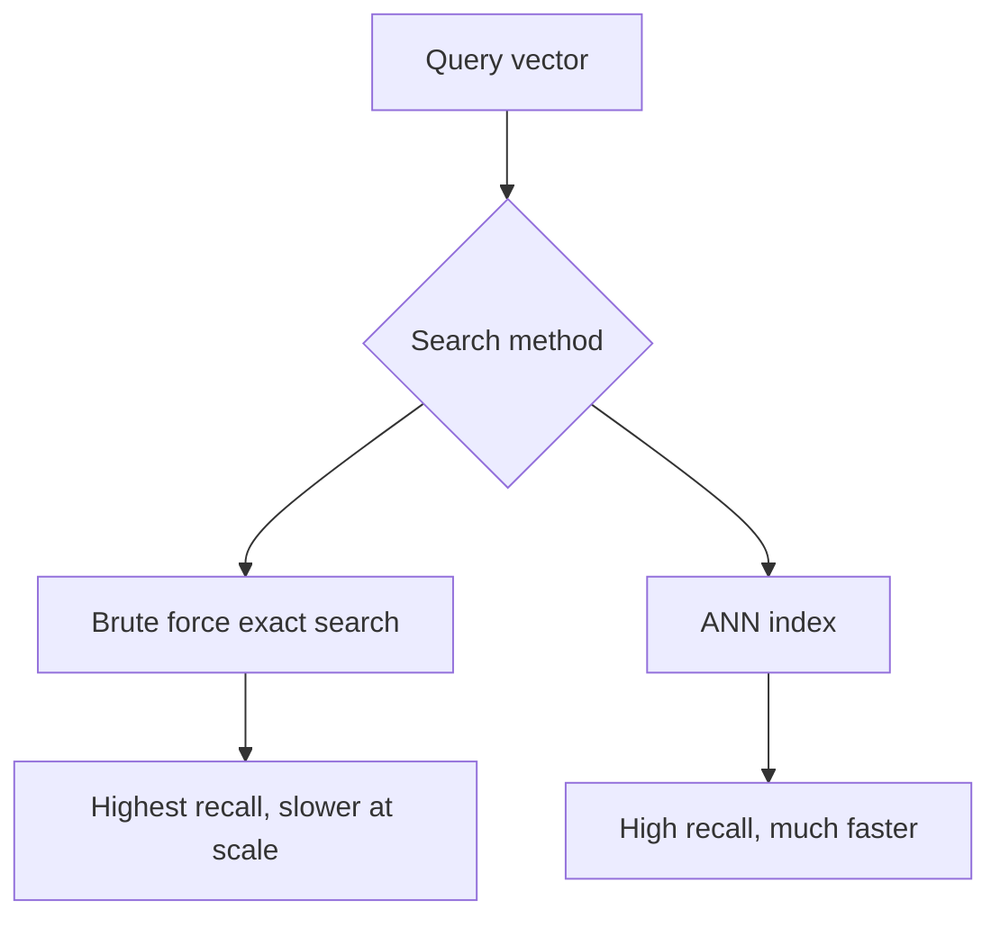
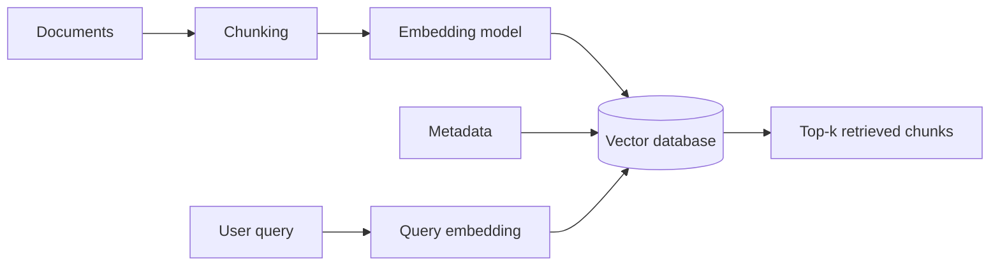
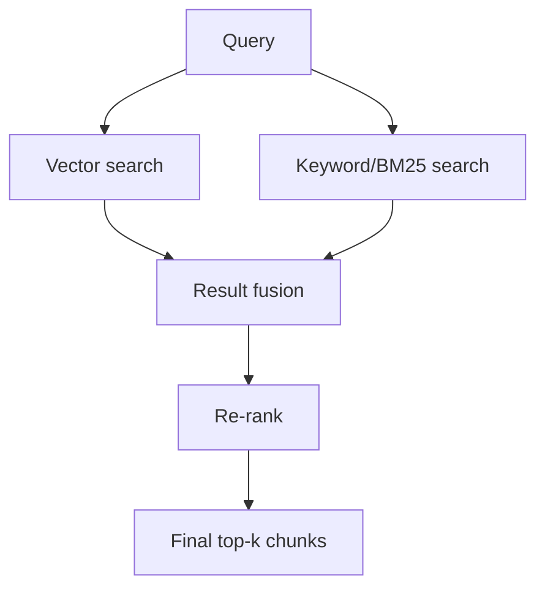
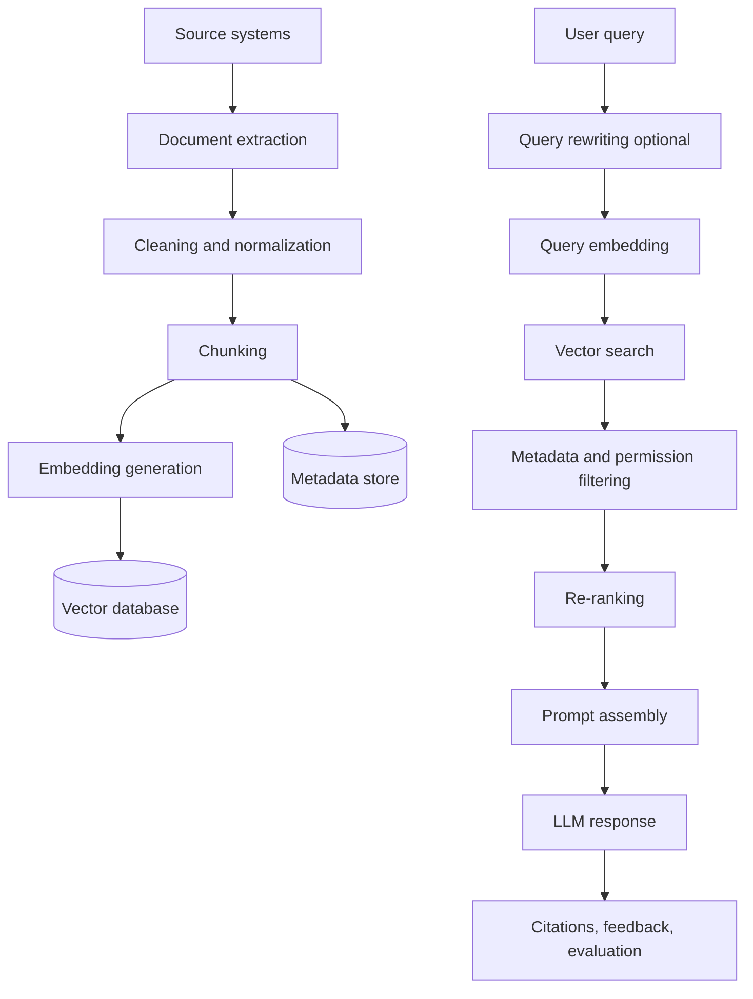
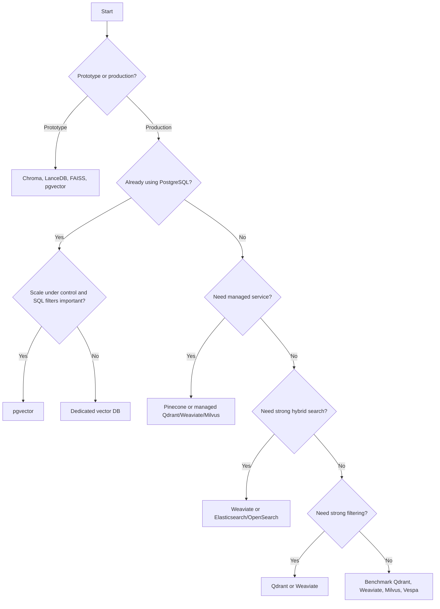
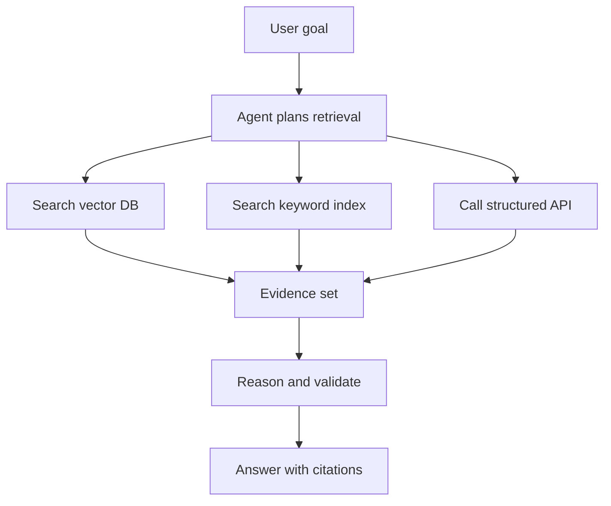

# Vector Databases and RAG: Practical Guide for AI/LLM Applications

**Audience:** Engineering colleagues, architects, technical leads, and developers building AI/LLM applications  
**Purpose:** Explain semantic search, embeddings, ANN search, vector databases, and RAG architecture in a practical way, with diagrams, comparison tables, code examples, best practices, pitfalls, interview questions, and references.

> **Note:** Product features, pricing, limits, and managed-service offerings change frequently. Use this guide as a conceptual and architectural reference, then verify vendor-specific details before making a production decision.

---

## Table of Contents

1. [Introduction](#1-introduction)
2. [From Text to Vectors](#2-from-text-to-vectors)
3. [Approximate Nearest Neighbor ANN Search](#3-approximate-nearest-neighbor-ann-search)
4. [Vector Databases](#4-vector-databases)
5. [Deep Dive: Popular Vector Database Options](#5-deep-dive-popular-vector-database-options)
6. [Comparison Tables](#6-comparison-tables)
7. [RAG Architecture](#7-rag-architecture)
8. [Choosing the Right Vector Database](#8-choosing-the-right-vector-database)
9. [Future Trends](#9-future-trends)
10. [Summary](#10-summary)
11. [Appendix: Quick Interview Questions](#appendix-quick-interview-questions)
12. [References for Further Reading](#references-for-further-reading)

---

## 1. Introduction

### Why semantic search?

Traditional search usually depends on exact words, keywords, field matches, stemming, and ranking signals. That is useful, but it often misses intent.

Semantic search uses **meaning** instead of only matching words. It converts text into vectors, then searches for nearby vectors that represent similar meaning.

Example:

| User query | Keyword search may look for | Semantic search can understand |
|---|---|---|
| "How do I reduce token usage?" | reduce, token, usage | cost optimization, prompt compression, context pruning |
| "Find defects related to login timeout" | login, timeout | authentication delay, session expiration, connection timeout |
| "Explain RAG accuracy issues" | RAG, accuracy | retrieval quality, chunking, ranking, hallucination risk |

### The limitations of keyword search

Keyword search is still valuable, but it has limitations:

- It may miss synonyms and paraphrases.
- It struggles with natural-language questions.
- It often requires users to know the exact terminology.
- It can over-rank documents that repeat keywords but are not actually relevant.
- It has difficulty understanding acronyms, domain language, and intent unless carefully tuned.

### Where vector databases fit in AI

Vector databases act as the retrieval layer for AI systems. They store embeddings and quickly return items that are semantically similar to a query.


Vector databases are commonly used for:

- Retrieval-Augmented Generation, or RAG
- Enterprise knowledge search
- Product search
- Recommendation systems
- Duplicate detection
- Image, audio, and multimodal similarity search
- AI agent memory and tool context retrieval

### Best practices

- Keep keyword search and semantic search as complementary tools.
- Use hybrid search when exact terms, acronyms, IDs, product names, or error codes matter.
- Evaluate retrieval quality before evaluating LLM answer quality.
- Treat the vector database as a system component, not as magic.

### Common pitfalls

- Assuming semantic search always beats keyword search.
- Ignoring metadata filters and access control.
- Choosing a vector database before understanding scale, latency, and governance requirements.
- Evaluating only demo quality, not production retrieval quality.

---

## 2. From Text to Vectors

### Tokenization

Tokenization splits text into smaller units called tokens. Tokens may be words, word fragments, punctuation, or special symbols.

Example:

```text
Input:  "Vector databases power RAG."
Tokens: ["Vector", " databases", " power", " R", "AG", "."]
```

Tokenization matters because:

- LLMs process tokens, not words.
- Context windows are measured in tokens.
- Embedding models also have input length limits.
- Chunking strategy should consider token length, not just character count.

### Vocabulary

A model vocabulary is the set of tokens the model knows how to represent. Text is mapped to token IDs before being processed by the model.


### Context windows

A context window is the maximum amount of text a model can process at once. For RAG, this impacts:

- How large chunks can be
- How many chunks can be passed to the LLM
- Whether retrieved results fit into the prompt
- Cost and latency

### Embeddings

An embedding is a numerical representation of meaning.

Example conceptually:

```text
"car"      -> [0.12, -0.44, 0.89, ...]
"vehicle"  -> [0.10, -0.41, 0.87, ...]
"banana"   -> [-0.73, 0.02, 0.15, ...]
```

Words or passages with similar meaning tend to be close in vector space.

### Embedding models

Embedding models convert text, images, code, or other content into vectors.

Common embedding model families include:

- OpenAI text embedding models
- Azure OpenAI embeddings
- Sentence Transformers
- BGE models
- E5 models
- Cohere embeddings
- Qwen embedding models
- CLIP-style multimodal embeddings

Selection criteria:

| Criterion | Why it matters |
|---|---|
| Domain fit | Engineering, legal, support, code, and product content may need different models |
| Vector dimension | Higher dimensions may improve representation but increase storage and search cost |
| Language support | Multilingual use cases need multilingual embedding models |
| Latency | Embedding generation can become a bottleneck |
| Cost | Large-scale ingestion can be expensive |
| Data policy | Private data may require approved internal or hosted models |

### Similarity metrics

Common similarity metrics:

| Metric | Meaning | Typical use |
|---|---|---|
| Cosine similarity | Compares vector angle | Text similarity, normalized embeddings |
| Dot product | Measures directional alignment and magnitude | Recommendation and retrieval models |
| Euclidean distance | Measures straight-line distance | Image, spatial, or numeric feature spaces |

### Python code example: simple text embeddings

```python
from sentence_transformers import SentenceTransformer
from sklearn.metrics.pairwise import cosine_similarity

model = SentenceTransformer("all-MiniLM-L6-v2")

sentences = [
    "Vector databases support semantic search.",
    "Embeddings help retrieve similar documents.",
    "The server failed due to a network timeout."
]

query = "How do I find related documents using embeddings?"

sentence_vectors = model.encode(sentences)
query_vector = model.encode([query])

scores = cosine_similarity(query_vector, sentence_vectors)[0]

for sentence, score in sorted(zip(sentences, scores), key=lambda x: x[1], reverse=True):
    print(f"{score:.3f} - {sentence}")
```

### Best practices

- Use the same embedding model for indexing and querying.
- Store model name and version with your vectors.
- Normalize vectors if your metric expects normalized vectors.
- Re-embed data when changing embedding models.
- Use representative evaluation questions from real users.

### Common pitfalls

- Mixing embeddings from different models in the same index.
- Ignoring embedding model version drift.
- Chunking documents without preserving source metadata.
- Choosing vector dimensions based only on popularity.

---

## 3. Approximate Nearest Neighbor ANN Search

### Why ANN exists

Exact search compares a query vector with every stored vector. This is called brute force or flat search.

For small datasets, brute force can be acceptable. At scale, it becomes too slow or too expensive.

Approximate Nearest Neighbor, or ANN, trades a small amount of recall for much faster search.



### Brute force

Brute force search computes similarity against every vector.

**Advantages**

- Exact result
- Simple to implement
- Useful as evaluation baseline

**Disadvantages**

- Expensive at scale
- High latency for large datasets
- Not suitable for high-QPS production retrieval without specialized hardware

### HNSW

HNSW stands for Hierarchical Navigable Small World. It builds a graph where nearby vectors are connected. Search navigates the graph to find close neighbors quickly.

**Good for**

- High recall
- Low-latency search
- RAG systems with frequent queries
- Dynamic inserts in many implementations

**Trade-offs**

- Uses more memory
- Index build can be expensive
- Filtering behavior depends on implementation

### IVF

IVF stands for Inverted File Index. It clusters vectors into partitions. At query time, the system searches only the nearest partitions.

**Good for**

- Large datasets
- Lower memory than HNSW
- Batch-oriented workloads

**Trade-offs**

- Recall depends on cluster quality and number of probed clusters
- Updates may require maintenance or re-clustering
- More tuning required

### Product Quantization PQ

Product Quantization compresses vectors by splitting them into subvectors and representing each part with compact codes.

**Good for**

- Reducing memory usage
- Large-scale indexes
- Cost-sensitive systems

**Trade-offs**

- Potential recall loss
- Often needs re-ranking with original vectors
- Requires careful evaluation

### DiskANN

DiskANN-style systems are designed for large-scale vector search using SSD/NVMe storage with a graph-based index. The goal is to reduce RAM requirements while keeping latency practical.

**Good for**

- Very large datasets
- Environments where RAM is expensive
- Billion-scale retrieval patterns

**Trade-offs**

- Higher operational complexity
- SSD performance matters
- May require specialized database support

### ANN trade-off table

| Method | Recall | Latency | Memory | Update friendliness | Typical fit |
|---|---:|---:|---:|---:|---|
| Brute force | Highest | Poor at scale | High | Simple | Baseline, small datasets |
| HNSW | High | Low | High | Good to medium | Production RAG default |
| IVF | Medium to high | Low | Medium | Medium | Large datasets |
| IVF-PQ | Medium to high | Low | Low | Medium | Cost-sensitive large datasets |
| DiskANN | High | Low to medium | Lower RAM, SSD heavy | Medium | Very large indexes |

### Python code example: FAISS HNSW-style index

```python
import numpy as np
import faiss

# Example vectors
np.random.seed(42)
dim = 384
vectors = np.random.random((1000, dim)).astype("float32")
query = np.random.random((1, dim)).astype("float32")

# Normalize for cosine similarity via inner product
faiss.normalize_L2(vectors)
faiss.normalize_L2(query)

# HNSW index
index = faiss.IndexHNSWFlat(dim, 32)
index.hnsw.efConstruction = 100
index.add(vectors)

index.hnsw.efSearch = 64
scores, ids = index.search(query, k=5)

print(ids)
print(scores)
```

### Best practices

- Always keep a small exact-search benchmark dataset.
- Measure recall@k, latency percentiles, and filtered recall.
- Tune index parameters using your real query patterns.
- Re-rank top candidates when quality matters.
- Monitor retrieval quality after model, chunking, or index changes.

### Common pitfalls

- Optimizing only average latency, not p95 or p99 latency.
- Testing without metadata filters.
- Ignoring access-control filters during benchmark design.
- Assuming vendor benchmark numbers apply directly to your corpus.

---

## 4. Vector Databases

### What makes a database a vector database?

A vector database is optimized to store, index, and query high-dimensional vectors together with metadata.

Core capabilities:

- Vector storage
- ANN indexing
- Similarity search
- Metadata storage
- Filtering
- CRUD operations
- Batch ingestion
- Hybrid keyword + vector search
- Scalability and replication
- API/SDK support
- Security and access control integration



### CRUD operations

Vector databases usually support:

| Operation | Meaning |
|---|---|
| Create / Upsert | Add vectors and metadata |
| Read / Query | Retrieve similar vectors |
| Update | Modify metadata or replace vector |
| Delete | Remove vectors by ID or filter |

### Metadata

Metadata is essential for enterprise RAG.

Examples:

- Source document name
- Page number
- Section heading
- Author
- Product area
- Release version
- Document type
- Tenant/customer ID
- Access-control labels
- Created and modified dates

### Filtering

Filters constrain retrieval.

Examples:

```json
{
  "product": "Teamcenter",
  "release": "2506",
  "classification": "internal",
  "document_type": "requirements"
}
```

Filtering is critical for:

- Security trimming
- Tenant isolation
- Product or release scoping
- Time-based retrieval
- Reducing irrelevant chunks

### Hybrid search

Hybrid search combines semantic vector search with keyword search.



Hybrid search helps when queries include:

- Exact product names
- API names
- Acronyms
- Error codes
- File names
- Version numbers
- Legal or regulated terminology

### Best practices

- Store enough metadata to explain, filter, debug, and cite every result.
- Use stable IDs for chunks.
- Keep original source references for traceability.
- Separate indexes by security boundary when needed.
- Run ingestion as a repeatable pipeline.

### Common pitfalls

- Treating metadata as optional.
- Losing page number or source document references.
- Not designing for deletes and re-indexing.
- Ignoring data classification and permissions.

---

## 5. Deep Dive: Popular Vector Database Options

The following summaries are intentionally practical. Verify exact limits, licensing, pricing, and deployment options before production adoption.

### Chroma

**Positioning:** Lightweight, developer-friendly vector store for local development, experiments, and prototypes.

**Good fit**

- Local RAG experiments
- Training demos
- Small knowledge bases
- Python-first workflows

**Watch-outs**

- Validate production suitability for your scale and operations model.
- Plan migration if prototype data grows into production use.

```python
import chromadb

client = chromadb.PersistentClient(path="./chroma_db")
collection = client.get_or_create_collection("demo_docs")

collection.add(
    ids=["doc1", "doc2"],
    documents=[
        "Vector databases store embeddings.",
        "RAG retrieves context before generation."
    ],
    metadatas=[
        {"source": "intro.md"},
        {"source": "rag.md"}
    ]
)

results = collection.query(
    query_texts=["How does RAG use vector search?"],
    n_results=2
)

print(results)
```

### Pinecone

**Positioning:** Managed vector database service focused on low-operations deployment.

**Good fit**

- Teams that want managed infrastructure
- SaaS or cloud-native RAG
- Variable workloads
- Production systems where operating the DB is not the team's core skill

**Watch-outs**

- Vendor lock-in considerations
- Cost at scale
- Data residency and enterprise compliance requirements

### Qdrant

**Positioning:** Open-source, Rust-based vector database with strong filtering and payload support.

**Good fit**

- Self-hosted or managed deployments
- Metadata-heavy retrieval
- Teams needing fine-grained filters
- Engineering teams comfortable operating services

**Watch-outs**

- Operational ownership for self-hosting
- Benchmark with your own filters and payload indexes

```python
from qdrant_client import QdrantClient
from qdrant_client.models import Distance, VectorParams, PointStruct

client = QdrantClient(path="./qdrant_local")

client.recreate_collection(
    collection_name="docs",
    vectors_config=VectorParams(size=3, distance=Distance.COSINE)
)

client.upsert(
    collection_name="docs",
    points=[
        PointStruct(id=1, vector=[0.1, 0.2, 0.3], payload={"source": "intro.md"}),
        PointStruct(id=2, vector=[0.2, 0.1, 0.4], payload={"source": "rag.md"})
    ]
)

hits = client.search(
    collection_name="docs",
    query_vector=[0.1, 0.2, 0.25],
    limit=2
)

print(hits)
```

### Weaviate

**Positioning:** Vector database with hybrid search, schema, modules, and cloud/self-host options.

**Good fit**

- Hybrid vector + keyword search
- Multi-tenant knowledge systems
- Applications benefiting from schema-driven data modeling
- Teams wanting managed or self-host choices

**Watch-outs**

- Understand module dependencies and deployment model.
- Tune hybrid search carefully for your domain.

### Elasticsearch / OpenSearch

**Positioning:** Search platforms that have added vector search capabilities, useful when an organization already operates them.

**Good fit**

- Existing Elasticsearch/OpenSearch teams
- Hybrid keyword + vector search
- Log, documentation, and observability-adjacent workloads
- Systems where keyword search remains central

**Watch-outs**

- Vector features and performance vary by version and configuration.
- Make sure ANN search, filtering, and security meet your requirements.

### Vespa

**Positioning:** Large-scale serving engine for search, recommendation, ranking, and ML-informed retrieval.

**Good fit**

- Complex ranking pipelines
- Search + recommendation systems
- High-scale applications needing custom ranking
- Teams with search platform expertise

**Watch-outs**

- Operational and learning complexity
- Not the simplest option for small RAG prototypes

### Redis

**Positioning:** In-memory data platform with vector search capabilities in Redis Stack / Redis Search.

**Good fit**

- Low-latency retrieval
- Existing Redis-based architectures
- Smaller hot indexes
- Cache + vector use cases

**Watch-outs**

- Memory cost
- Durability and scaling design
- Feature availability depends on Redis distribution and module support

### LanceDB

**Positioning:** Embedded/open-source vector database designed around columnar data and local-first workflows.

**Good fit**

- Data science workflows
- Local or embedded retrieval
- Multimodal datasets
- Prototyping with file/table-backed storage

**Watch-outs**

- Validate production deployment model and concurrency needs.

### pgvector

**Positioning:** PostgreSQL extension for storing vectors alongside relational data.

**Good fit**

- Teams already using PostgreSQL
- Smaller to medium datasets
- Tight coupling between relational metadata and vectors
- Simpler operations when Postgres is already approved

**Watch-outs**

- Postgres tuning matters.
- Very large-scale ANN may require dedicated vector systems.
- Carefully test filters, indexes, and query plans.

```sql
CREATE EXTENSION IF NOT EXISTS vector;

CREATE TABLE documents (
    id bigserial PRIMARY KEY,
    content text,
    source text,
    embedding vector(384)
);

-- Example nearest-neighbor query using cosine distance
SELECT id, content, source
FROM documents
ORDER BY embedding <=> '[0.1,0.2,0.3]'::vector
LIMIT 5;
```

### Vald

**Positioning:** Cloud-native distributed vector search engine often associated with Kubernetes-native deployments.

**Good fit**

- Kubernetes-first environments
- Distributed vector search
- Teams needing control over deployment topology

**Watch-outs**

- Requires platform engineering maturity.
- Validate ecosystem fit and operational support.

---

## 6. Comparison Tables

### Feature comparison

| Option | Type | Managed option | Self-host option | Hybrid search | Metadata filtering | Best initial use |
|---|---|---:|---:|---:|---:|---|
| Chroma | Vector DB / library | Varies by offering | Yes | Limited / evolving | Basic | Prototypes, demos |
| Pinecone | Managed vector DB | Yes | No | Yes, depending on offering | Yes | Managed production RAG |
| Qdrant | Vector DB | Yes | Yes | Yes / integrations | Strong | Filter-heavy retrieval |
| Weaviate | Vector DB | Yes | Yes | Strong | Strong | Hybrid enterprise search |
| Elasticsearch | Search platform | Yes | Yes | Strong | Strong | Existing search stack |
| Vespa | Serving/search platform | Yes / self-managed options | Yes | Strong | Strong | Custom ranking at scale |
| Redis | Data platform | Yes | Yes | With modules | Yes | Low-latency hot index |
| LanceDB | Embedded/vector DB | Yes / cloud options | Yes | Varies | Yes | Local-first, multimodal |
| pgvector | Postgres extension | Through Postgres providers | Yes | With SQL/search integration | Strong via SQL | Existing Postgres apps |
| Vald | Distributed vector search | Usually self/platform managed | Yes | Varies | Varies | Kubernetes-native vector search |

### Architecture comparison

| Architecture style | Examples | Strengths | Weaknesses |
|---|---|---|---|
| Embedded/local | Chroma, LanceDB | Simple, fast to prototype, low setup | Limited scale and team sharing unless served |
| Managed SaaS | Pinecone, hosted Qdrant, hosted Weaviate | Low ops, fast production start | Cost, lock-in, compliance review |
| Self-hosted service | Qdrant, Weaviate, Milvus, Vald | Control, data locality, customization | Requires operations and monitoring |
| Search platform extension | Elasticsearch, OpenSearch | Strong keyword + vector + filters | May need careful tuning for vector workloads |
| Relational extension | pgvector | Simple if Postgres is already used | Not always ideal for very large vector-only workloads |

### Performance considerations

| Dimension | What to measure | Why it matters |
|---|---|---|
| Recall@k | How many true relevant results are retrieved | Retrieval quality |
| p50/p95/p99 latency | Query latency distribution | User experience and SLA |
| Throughput | Queries per second and ingestion rate | Capacity planning |
| Filtered recall | Recall after metadata/security filters | Enterprise relevance |
| Index build time | Time to create or rebuild indexes | Operational recovery |
| Update/delete latency | Freshness after document changes | Data correctness |
| Memory footprint | RAM per million vectors | Infrastructure cost |
| Storage footprint | Disk/SSD per million vectors | Cost and backup planning |

### Pricing considerations

Instead of comparing static prices, compare cost drivers:

| Cost driver | Questions to ask |
|---|---|
| Vector count | How many chunks will we store now and later? |
| Dimension size | How many dimensions per vector? |
| Query volume | What is average and peak QPS? |
| Ingestion volume | How often are documents updated? |
| Metadata size | How much payload or metadata is stored? |
| Replication | How many replicas or availability zones? |
| Managed service fees | Are we paying for storage, compute, requests, pods, or serverless usage? |
| Egress/network | Are there cross-region or external API costs? |
| Operations | What platform engineering effort is required? |

### Scalability comparison

| Scale | Typical recommendation |
|---|---|
| Laptop prototype | Chroma, LanceDB, FAISS, small pgvector |
| Small internal app | pgvector, Qdrant, Weaviate, Elasticsearch if already available |
| Enterprise RAG with filters | Qdrant, Weaviate, Elasticsearch/OpenSearch, Pinecone, pgvector with careful tuning |
| High-scale managed service | Pinecone or managed Qdrant/Weaviate/Milvus-style offerings |
| Billion-scale specialized search | Milvus/Zilliz, Vespa, DiskANN-capable systems, custom FAISS/ANN infrastructure |

### Ecosystem comparison

| Ecosystem need | Look for |
|---|---|
| LangChain / LlamaIndex integration | Official or mature connectors |
| Cloud deployment | Terraform, Helm, managed offering, private networking |
| Security | IAM, API keys, encryption, audit logs, data isolation |
| Observability | Metrics for latency, recall proxy signals, indexing status, errors |
| Backup/restore | Snapshot and disaster recovery process |
| Governance | Data classification, retention, deletion, access control |

---

## 7. RAG Architecture

### Complete pipeline



### Ingestion

Ingestion converts source material into clean, retrievable knowledge.

Steps:

1. Load documents from source systems.
2. Extract text, tables, images, and metadata.
3. Remove boilerplate and irrelevant content.
4. Normalize formatting.
5. Split into chunks.
6. Generate embeddings.
7. Store vectors and metadata.
8. Validate retrieval quality.

### Chunking

Chunking breaks large documents into smaller passages.

Common approaches:

| Strategy | Description | Good for |
|---|---|---|
| Fixed-size chunks | Split by token count | Simple baseline |
| Overlapping chunks | Preserve context across chunk boundaries | Narrative documents |
| Section-based chunks | Split by headings | Technical docs, manuals |
| Semantic chunks | Split by meaning | Higher-quality retrieval |
| Table-aware chunks | Preserve table structure | Specifications, reports |

### Embedding generation

Embedding generation should be treated as a controlled pipeline:

- Track input text.
- Track model name and version.
- Track chunk ID and source hash.
- Retry failed embedding calls.
- Avoid embedding duplicate content.
- Rate-limit and batch requests.

### Storage

Store each chunk with:

```json
{
  "chunk_id": "doc123-page5-section2-chunk1",
  "source_uri": "...",
  "title": "Installation Guide",
  "page": 5,
  "section": "Troubleshooting",
  "product": "ExampleProduct",
  "release": "2506",
  "classification": "internal",
  "embedding_model": "example-embedding-model-v1",
  "content_hash": "..."
}
```

### Retrieval

Retrieval should include:

1. Query normalization
2. Query embedding
3. Metadata filtering
4. ANN search
5. Optional keyword search
6. Result fusion
7. Deduplication
8. Re-ranking
9. Context window packing
10. Citation preparation

### Re-ranking

Re-ranking improves final context quality. It can use:

- Cross-encoder rerankers
- LLM-based ranking
- Business rules
- Freshness signals
- Authority signals
- Exact keyword boosts

### LLM response

A good RAG response should:

- Use only retrieved context for factual claims.
- Cite sources.
- Say when information is missing.
- Avoid over-answering beyond evidence.
- Preserve permissions and data classification.

### Python mini-example: simple RAG skeleton

```python
from sentence_transformers import SentenceTransformer
import chromadb

embedding_model = SentenceTransformer("all-MiniLM-L6-v2")
client = chromadb.PersistentClient(path="./rag_demo")
collection = client.get_or_create_collection("knowledge_base")

docs = [
    "RAG retrieves relevant context before sending a prompt to the LLM.",
    "Hybrid search combines keyword search with vector similarity.",
    "Metadata filters help enforce product, release, and access boundaries."
]

embeddings = embedding_model.encode(docs).tolist()

collection.add(
    ids=["1", "2", "3"],
    documents=docs,
    embeddings=embeddings,
    metadatas=[
        {"topic": "rag"},
        {"topic": "search"},
        {"topic": "governance"}
    ]
)

query = "How do filters help in RAG?"
query_embedding = embedding_model.encode([query]).tolist()[0]

results = collection.query(
    query_embeddings=[query_embedding],
    n_results=2
)

context = "\n".join(results["documents"][0])

prompt = f"""
Answer the user question using only the context below.
If the answer is not in the context, say you do not know.

Context:
{context}

Question: {query}
"""

print(prompt)
```

### Best practices

- Evaluate ingestion, retrieval, and generation separately.
- Log retrieved chunk IDs for every answer.
- Use citations and traceability for auditability.
- Include access-control checks before content reaches the LLM.
- Maintain a golden evaluation set of representative questions.

### Common pitfalls

- Sending too many chunks to the LLM.
- Sending low-quality chunks because retrieval was not evaluated.
- Ignoring stale data, deleted files, or changed permissions.
- Treating RAG as only a prompt-engineering problem.

---

## 8. Choosing the Right Vector Database

### Decision tree



### Real-world recommendations

| Situation | Practical recommendation |
|---|---|
| Learning/demo | Chroma or LanceDB |
| Existing PostgreSQL app | Start with pgvector, benchmark before scaling up |
| Strong keyword + vector search | Elasticsearch/OpenSearch or Weaviate |
| Heavy metadata filtering | Qdrant or Weaviate |
| Low operations | Pinecone or managed vector DB |
| Regulated/on-prem | Self-hosted Qdrant, Weaviate, Milvus, Elasticsearch, pgvector, or approved internal platform |
| Very large-scale retrieval | Benchmark Milvus/Zilliz, Vespa, DiskANN-capable systems, or specialized architecture |
| Team already operates search infra | Consider Elasticsearch/OpenSearch before adding another platform |

### Evaluation checklist

Use this checklist before selecting a platform:

- [ ] What is the expected vector count in 3, 12, and 24 months?
- [ ] What embedding dimensions are used?
- [ ] How much metadata is stored per chunk?
- [ ] What filters are mandatory?
- [ ] What are the access-control requirements?
- [ ] What is the required recall@k?
- [ ] What are p95 and p99 latency targets?
- [ ] What is the ingestion/update frequency?
- [ ] What is the deletion and re-indexing process?
- [ ] How will backups and disaster recovery work?
- [ ] How will retrieval quality be evaluated?
- [ ] How will costs be monitored?
- [ ] What is the migration path if the first choice fails?

### Best practices

- Start with requirements, not vendor preference.
- Build a small benchmark using real documents and real questions.
- Include security filters in the benchmark.
- Evaluate at realistic scale.
- Prefer boring, supportable architecture for production.

### Common pitfalls

- Selecting a database based on a single blog benchmark.
- Ignoring operational ownership.
- Forgetting data governance, retention, and delete requirements.
- Building a prototype that cannot migrate cleanly.

---

## 9. Future Trends

### Multimodal embeddings

Embeddings are increasingly used for more than text:

- Images
- Audio
- Video
- CAD/3D artifacts
- Tables
- Code
- Logs
- Sensor data

This enables search across multiple modalities, such as finding documents, diagrams, and screenshots related to the same concept.

### Agentic RAG

Agentic RAG goes beyond a single retrieval step. An agent may:

1. Analyze the question.
2. Decide which sources to search.
3. Retrieve multiple times.
4. Ask clarifying sub-questions internally.
5. Use tools or APIs.
6. Validate the draft answer.
7. Return a grounded response.



### Knowledge graphs

Knowledge graphs can complement vector databases by representing explicit relationships.

Examples:

- Product -> has release -> version
- Requirement -> verified by -> test case
- Defect -> affects -> component
- Person -> owns -> service

Vector search is good at fuzzy semantic matching. Knowledge graphs are good at explicit relationships and explainable traversal.

### Hybrid databases

Vector search is becoming a feature in many database platforms, not just a separate product category. This trend may reduce the need for a dedicated vector database in smaller or medium-scale applications.

Examples of hybrid directions:

- Relational + vector
- Search + vector
- Graph + vector
- Object storage + vector index
- Data lake + vector retrieval

### Best practices

- Design for portability: store raw chunks and metadata outside the vector index.
- Avoid irreversible vendor-specific choices in early prototypes.
- Track embedding model lineage.
- Expect multi-index and hybrid retrieval patterns.

### Common pitfalls

- Assuming one database will own all retrieval forever.
- Ignoring graph and structured data when semantic search is not enough.
- Overusing agents when deterministic retrieval is sufficient.
- Not evaluating privacy and access-control implications of agentic retrieval.

---

## 10. Summary

### Key takeaways

- Semantic search retrieves by meaning, not just keywords.
- Embeddings are numerical representations of content.
- Vector databases store embeddings and retrieve nearest neighbors quickly.
- ANN search is essential for scale, but it introduces trade-offs.
- Metadata and filtering are not optional in enterprise RAG.
- Hybrid search is often better than pure vector search for engineering content.
- RAG quality depends on ingestion, chunking, embedding, retrieval, ranking, and generation.
- The right vector database depends on scale, operations, security, cost, filtering, and ecosystem fit.

### Practical recommendation for colleagues

For most internal engineering teams:

1. Start with a small prototype using Chroma, LanceDB, FAISS, or pgvector.
2. Create a realistic evaluation set from actual user questions.
3. Add metadata and access-control assumptions early.
4. Test hybrid search if the content contains exact terms, IDs, acronyms, or release numbers.
5. Benchmark two or three serious candidates before production.
6. Make retrieval quality measurable before optimizing LLM prompts.

---

## Appendix: Quick Interview Questions

### Conceptual

1. What problem does semantic search solve that keyword search does not?
2. What is an embedding?
3. Why do we need vector databases for RAG?
4. What is the difference between exact nearest-neighbor search and ANN search?
5. Why is metadata important in enterprise RAG?

### Technical

1. Explain cosine similarity, dot product, and Euclidean distance.
2. How does HNSW work at a high level?
3. What are the trade-offs between HNSW and IVF?
4. Why is Product Quantization useful?
5. What is filtered recall and why does it matter?

### Architecture

1. Draw a complete RAG pipeline.
2. Where should access control be enforced in RAG?
3. What metadata would you store for each chunk?
4. How would you evaluate retrieval quality?
5. How would you handle document updates and deletes?

### Practical decision-making

1. When would you choose pgvector over a dedicated vector database?
2. When would you choose a managed service like Pinecone?
3. When is Elasticsearch/OpenSearch a good fit?
4. When is hybrid search better than vector-only search?
5. What questions would you ask before selecting a vector database for production?

---

## References for Further Reading

### General concepts

- [Retrieval-Augmented Generation overview from NVIDIA](https://blogs.nvidia.com/blog/what-is-retrieval-augmented-generation/)
- [Microsoft Azure AI Search vector search documentation](https://learn.microsoft.com/azure/search/vector-search-overview)
- [LangChain RAG documentation](https://python.langchain.com/docs/tutorials/rag/)
- [LlamaIndex RAG concepts](https://docs.llamaindex.ai/en/stable/understanding/rag/)

### Vector search and ANN

- [FAISS documentation](https://faiss.ai/)
- [HNSW paper: Efficient and robust approximate nearest neighbor search using Hierarchical Navigable Small World graphs](https://arxiv.org/abs/1603.09320)
- [DiskANN paper](https://www.microsoft.com/en-us/research/publication/diskann-fast-accurate-billion-point-nearest-neighbor-search-on-a-single-node/)
- [ScaNN documentation](https://github.com/google-research/google-research/tree/master/scann)

### Vector databases and search platforms

- [Chroma documentation](https://docs.trychroma.com/)
- [Pinecone documentation](https://docs.pinecone.io/)
- [Qdrant documentation](https://qdrant.tech/documentation/)
- [Weaviate documentation](https://weaviate.io/developers/weaviate)
- [Elasticsearch vector search documentation](https://www.elastic.co/guide/en/elasticsearch/reference/current/knn-search.html)
- [OpenSearch vector search documentation](https://opensearch.org/docs/latest/search-plugins/vector-search/)
- [Vespa nearest neighbor search documentation](https://docs.vespa.ai/en/nearest-neighbor-search.html)
- [Redis vector search documentation](https://redis.io/docs/latest/develop/ai/search-and-query/vectors/)
- [LanceDB documentation](https://lancedb.github.io/lancedb/)
- [pgvector GitHub repository](https://github.com/pgvector/pgvector)
- [Vald documentation](https://vald.vdaas.org/)

### Evaluation and RAG quality

- [RAGAS evaluation framework](https://docs.ragas.io/)
- [TruLens RAG evaluation](https://www.trulens.org/)
- [LlamaIndex evaluation docs](https://docs.llamaindex.ai/en/stable/module_guides/evaluating/)

---
