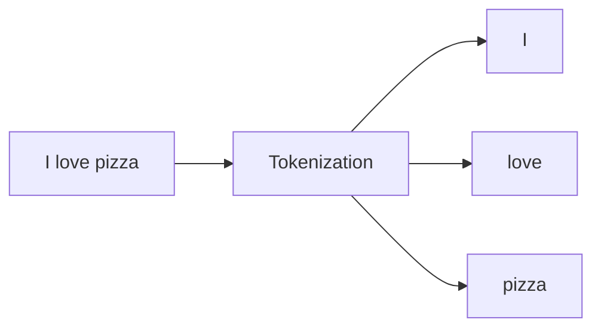
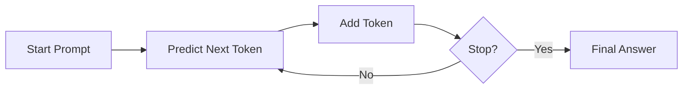

# 🧠 How AI Understands Language (Tokens, Embeddings, Vectors)

---

## 🌟 Introduction

When you talk to an AI like ChatGPT, it does NOT read sentences like humans.
Instead, it converts language into numbers and does math very quickly.

This document explains 3 key ideas:

* Tokens (pieces of words)
* Embeddings (meaning as numbers)
* Vectors (how those numbers are stored)
* How a full sentence flows through an AI model

---

# 🧩 1. Tokens = Pieces of Text

AI does not see full sentences at once.
It breaks sentences into small pieces called **tokens**.

### Example:

Sentence:

> "I love pizza"

Becomes:

* "I"
* "love"
* "pizza"

### 🧠 Think of it like:

Tokens = LEGO blocks of language

---

## 🔍 Tokenization Visual



---

# 🧠 2. Embeddings = Meaning in Numbers

AI cannot understand words directly.
So it converts each token into a **meaning representation using numbers**.

This is called an **embedding**.

### Example:

| Word   | Embedding (simplified) |
| ------ | ---------------------- |
| pizza  | [0.2, -1.1, 3.4]       |
| burger | [0.3, -1.0, 3.2]       |

Notice:

* pizza and burger have similar numbers → similar meaning

---

## 🎮 Analogy 1: Video Game Characters

Imagine a video game where every player has stats:

* Strength
* Magic
* Speed

Each player becomes a **number vector** like:

* Player A → [8, 3, 6]
* Player B → [7, 4, 5]

Players with similar stats behave similarly in the game.

👉 In the same way, words like "pizza" and "burger" get similar embeddings because they are similar in meaning.

---

## 🧑‍🤝‍🧑 Analogy 2: Real-Life Personality Scores (Big Five Traits)

In psychology, people are often described using the **Big Five personality traits**:

* Openness
* Conscientiousness
* Extraversion
* Agreeableness
* Neuroticism

Each person can be represented as a score vector like:

* Person A → [0.8, 0.6, 0.4, 0.7, 0.2]
* Person B → [0.3, 0.9, 0.5, 0.6, 0.4]

People with similar personalities have similar score patterns.

👉 Similarly, embeddings represent the "personality" of words in numeric form.

---

### 🧠 Think of it like:

Embeddings = “meaning GPS coordinates in an idea world”

---

## 🗺️ Meaning Space Visualization

A **vector** is just a list of numbers.

Example:

```
[0.2, -1.1, 3.4]
```

So:

* Embeddings are stored as vectors
* Vectors are just the format (like a container)

### 🧠 Think of it like:

Vector = a backpack holding meaning numbers

---

# 🔄 4. How a Sentence Flows Through an LLM

Now let’s put everything together.

Sentence:

> "I love pizza"

---

## 🧠 Full AI Pipeline

```mermaid
flowchart LR
A[User Sentence<br/>"I love pizza"] --> B[Tokenization<br/>Split into words]
B --> C[Token IDs<br/>Numbers]
C --> D[Embeddings<br/>Meaning vectors]
D --> E[Transformer Model<br/>AI Brain]
E --> F[Prediction<br/>Next word probabilities]
F --> G[Decoder<br/>Pick next word]
G --> H[Output Text<br/>"because it's delicious"]
H --> I[Repeat Loop<br/>Generate full response]
```

---

## ⚙️ What happens inside the AI Brain?

Inside the **Transformer Model**:

* It looks at all words together
* Finds relationships between them
* Understands context
* Decides what comes next

Example:

> "love" is strongly connected to "pizza"

---

# 🔁 Why AI Generates One Word at a Time

AI does NOT write full sentences at once.
It builds them step by step:

1. Predict next word
2. Add it to sentence
3. Predict again
4. Repeat

---

## 🔄 Generation Loop



---

# 🚀 Big Picture Summary

Here is the whole idea in simple form:

* 🧩 Tokens = pieces of words
* 🧠 Embeddings = meaning in numbers
* 📊 Vectors = how meanings are stored
* ⚙️ Transformer = brain that reasons
* 🗣️ Output = one word at a time

---

# 🎯 Final Analogy

Think of AI like a super-fast chef:

* Tokens = ingredients
* Embeddings = flavor profiles
* Vectors = recipe cards
* Transformer = cooking process
* Output = finished dish (sentence)

---

